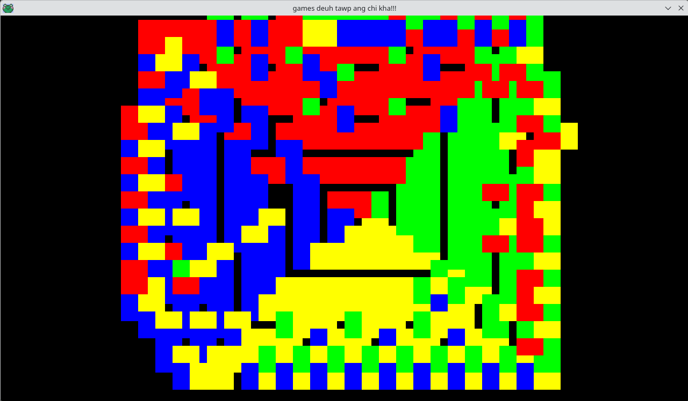

# games-deuh-tawp
for the purpose of game making progress logging...

## some-demo-as-of-now  
  
This is the kind of image that you can create with this game.  
You can use the w-a-s-d keys to move around and as you move around  
you will see that the color changes. One direction has a default color.  